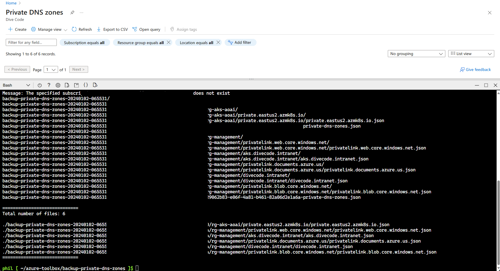

# Backup and Restore Azure Private DNS Zones

This script will backup all Private DNS Zones in a TENANT to local directory.

## Screenshot



## 1. Backup Walkthrough

> Backup all Private DNS Zones in a TENANT to local directory.

[https://cloud.azure.com](https://cloud.azure.com)

```bash
git clone https://github.com/pichuang/azure-toolbox.git
cd azure-toolbox

#
# Modified variables in .env
#

./backup-private-dns-zones.sh
```

## 2. Restore Walkthrough

> Restore specific Private DNS Zone from local directory.

```bash
#
# Modified variables in .env
#
./restore-private-dns-zone.sh
```